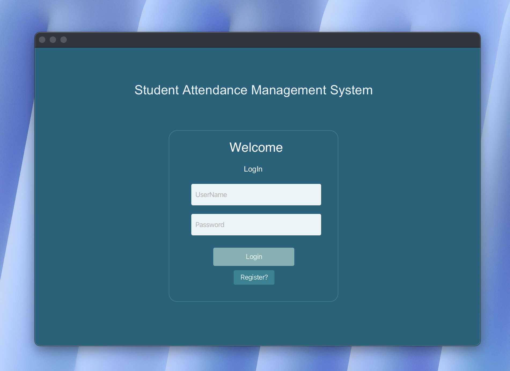
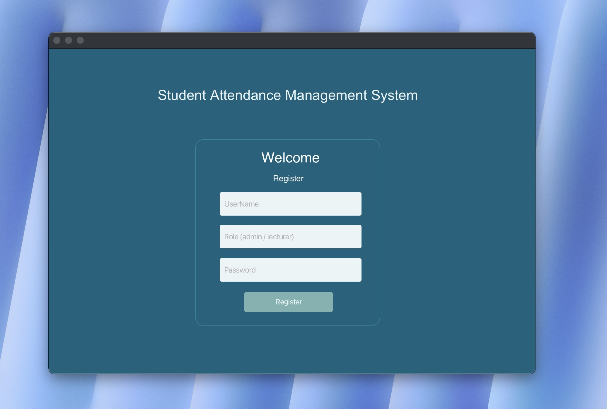
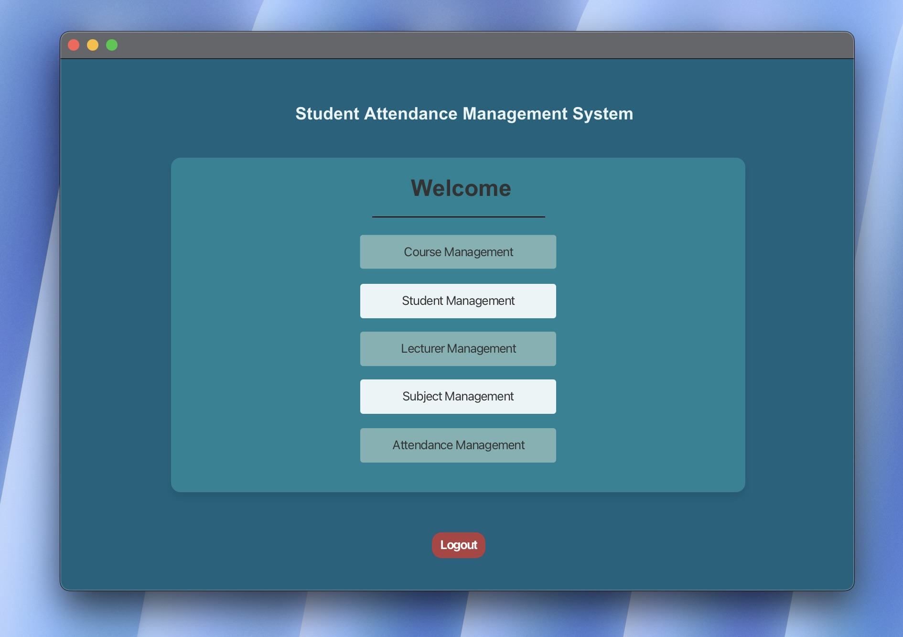
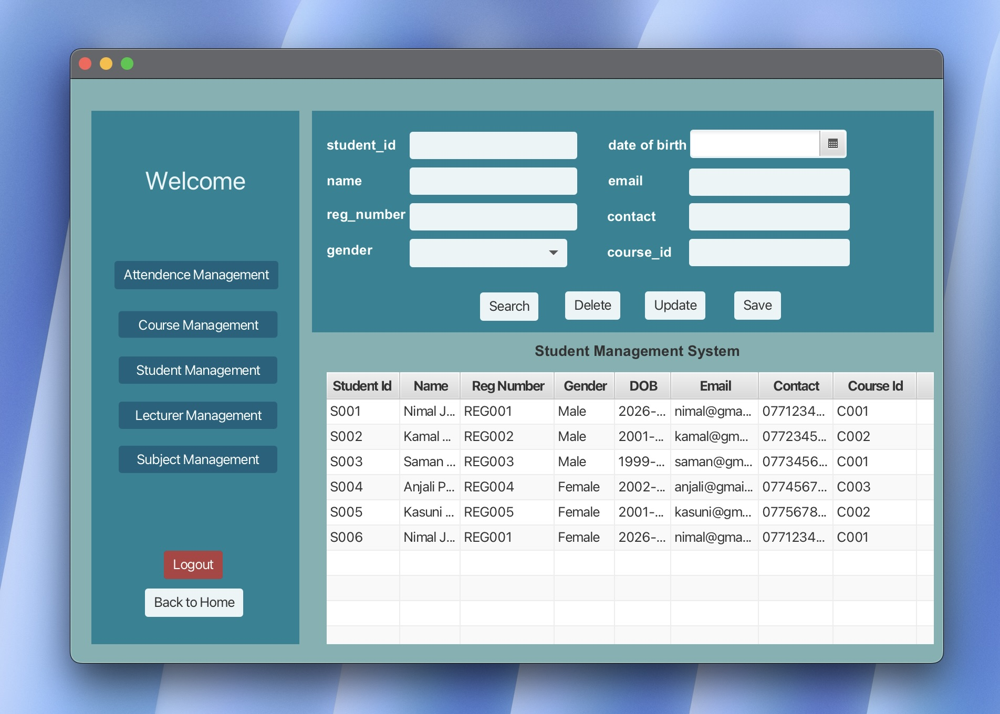

# Student Attendance Management System (SAMS)
## Project Overview

The Student Attendance Management System (SAMS) is a desktop-based application developed to simplify and automate attendance tracking for educational institutions.
This system enables administrators and lecturers to manage students, lecturers, courses, subjects, attendance records, and generate attendance-related reports efficiently.

## Features
User Authentication

Secure Login System

Role-Based Access (Admin / Lecturer)

### Course Management
Add New Courses

Update Course Details

Delete Courses

View All Courses

### Student Management

Register New Students

Update Student Information

Delete Student Records

Search/View Students

### Lecturer Management

Add Lecturers

Update Lecturer Details

Delete Lecturer Records

Assign Subjects

### Subject Management

Add Subjects

Update Subjects

Delete Subjects

Assign Subjects to Courses

###Attendance Management

Mark Attendance per Student

Store Daily Attendance Records

View Attendance History

### Attendance Reporting

Generate Attendance Reports

Filter by Student / Subject / Date

### Technologies Used

Programming Language: Java | UI Framework: JavaFX
Database: MySQL | Database Connectivity: JDBC

Architecture Pattern: Layered Architecture

Version Control: Git & GitHub

IDE: IntelliJ IDEA

### Project Architecture

This project follows Layered Architecture:

Presentation Layer → Service Layer → Data Access Layer

### Database Structure

Main Tables Used:

User | Student | Lecturer | Course | Subject | Attendance

### Setup Instructions

Prerequisites

### System Requirements

Java JDK 21+ \ MySQL Server
IntelliJ IDEA / Any Java IDE
JavaFX SDK
Installation Steps
Clone the Repository
git clone https://github.com/your-username/student-attendance-management-system.git
Import Database
Open MySQL
Create a new database: | CREATE DATABASE samsdb;
Import provided SQL script.
Configure Database Connection
Update your DB connection file:
private static final String URL = "jdbc:mysql://localhost:3306/samsdb";
private static final String USER = "root";
private static final String PASSWORD = "yourpassword";
Run the Application
Open project in IDE
Run AppInitializer.java

### Screenshots

## Learning Outcomes

This project demonstrates understanding of:

Object-Oriented Programming (OOP) | JavaFX UI Development
MySQL Database Integration | JDBC Connectivity
CRUD Operations | Layered Software Architecture

## Author

Sanjana Abeysinghe

Software Engineering Student

### License

This project is developed for educational purposes as coursework.
